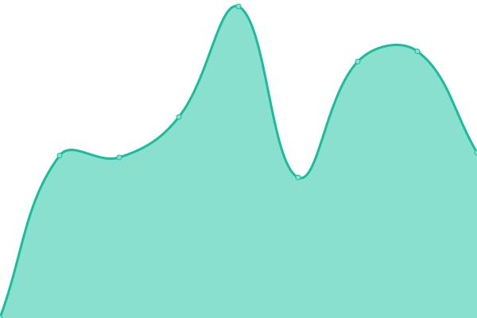
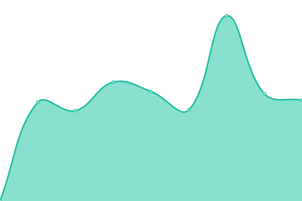
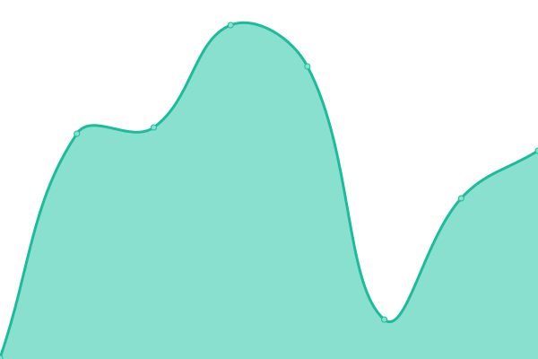
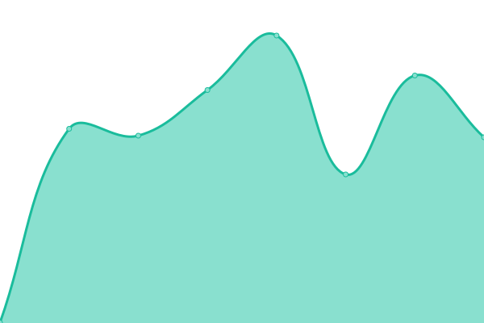

# [📈 Live Status](https://laurentS.github.io/myupptime): <!--live status--> **🟩 All systems operational**

This repository contains the open-source uptime monitor and status page for [Laurent Savaete](https://openfindata.io), powered by [Upptime](https://github.com/upptime/upptime).

With [Upptime](https://upptime.js.org), you can get your own unlimited and free uptime monitor and status page, powered entirely by a GitHub repository. We use [Issues](https://github.com/laurentS/myupptime/issues) as incident reports, [Actions](https://github.com/laurentS/myupptime/actions) as uptime monitors, and [Pages](https://laurentS.github.io/myupptime) for the status page.

<!--start: status pages-->
<!-- This summary is generated by Upptime (https://github.com/upptime/upptime) -->
<!-- Do not edit this manually, your changes will be overwritten -->
<!-- prettier-ignore -->
| URL | Status | History | Response Time | Uptime |
| --- | ------ | ------- | ------------- | ------ |
|  [MaDada frontpage](https://madada.fr) | 🟩 Up | [ma-dada-frontpage.yml](https://github.com/laurentS/myupptime/commits/HEAD/history/ma-dada-frontpage.yml) | 

 945ms
     
 | 

<a href="https://laurentS.github.io/myupptime/history/ma-dada-frontpage">98.04%</a>
    

|  [MaDada blog](https://blog.madada.fr) | 🟩 Up | [ma-dada-blog.yml](https://github.com/laurentS/myupptime/commits/HEAD/history/ma-dada-blog.yml) | 

 543ms
     
 | 

<a href="https://laurentS.github.io/myupptime/history/ma-dada-blog">100.00%</a>
    

|  [MaDada blog feed](https://madada-team.gitlab.io/site/feed.xml?lang=fr-FR) | 🟩 Up | [ma-dada-blog-feed.yml](https://github.com/laurentS/myupptime/commits/HEAD/history/ma-dada-blog-feed.yml) | 

 609ms
     
 | 

<a href="https://laurentS.github.io/myupptime/history/ma-dada-blog-feed">100.00%</a>
    

|  [MaDada authorities list](https://madada.fr/body/list/all) | 🟩 Up | [ma-dada-authorities-list.yml](https://github.com/laurentS/myupptime/commits/HEAD/history/ma-dada-authorities-list.yml) | 

 1654ms
     
 | 

<a href="https://laurentS.github.io/myupptime/history/ma-dada-authorities-list">98.04%</a>
    

|  [MaDada user page](https://madada.fr/user/laurent_savaete) | 🟩 Up | [ma-dada-user-page.yml](https://github.com/laurentS/myupptime/commits/HEAD/history/ma-dada-user-page.yml) | 

 151ms
     
 | 

<a href="https://laurentS.github.io/myupptime/history/ma-dada-user-page">98.05%</a>
    

|  [MapSwipe public page](https://mapswipe.org) | 🟩 Up | [map-swipe-public-page.yml](https://github.com/laurentS/myupptime/commits/HEAD/history/map-swipe-public-page.yml) | 

 117ms
     
 | 

<a href="https://laurentS.github.io/myupptime/history/map-swipe-public-page">100.00%</a>
    

|  [OpenFinData landing page](https://openfindata.io) | 🟩 Up | [open-fin-data-landing-page.yml](https://github.com/laurentS/myupptime/commits/HEAD/history/open-fin-data-landing-page.yml) | 

 614ms
     
 | 

<a href="https://laurentS.github.io/myupptime/history/open-fin-data-landing-page">100.00%</a>
    

|  [OpenFinData API docs](https://api.openfindata.io/docs) | 🟩 Up | [open-fin-data-api-docs.yml](https://github.com/laurentS/myupptime/commits/HEAD/history/open-fin-data-api-docs.yml) | 

 458ms
     
 | 

<a href="https://laurentS.github.io/myupptime/history/open-fin-data-api-docs">100.00%</a>
    

|  [OpenFinData public summary example](https://api.openfindata.io/api/v1/funds/summary_public/US47103E1221) | 🟩 Up | [open-fin-data-public-summary-example.yml](https://github.com/laurentS/myupptime/commits/HEAD/history/open-fin-data-public-summary-example.yml) | 

 556ms
     
 | 

<a href="https://laurentS.github.io/myupptime/history/open-fin-data-public-summary-example">99.81%</a>
    

<!--end: status pages-->

[**Visit our status website →**](https://laurentS.github.io/myupptime)

## 📄 License

- Powered by: [Upptime](https://github.com/upptime/upptime)
- Code: [MIT](./LICENSE) © [Laurent Savaete](https://openfindata.io)
- Data in the `./history` directory: [Open Database License](https://opendatacommons.org/licenses/odbl/1-0/)
